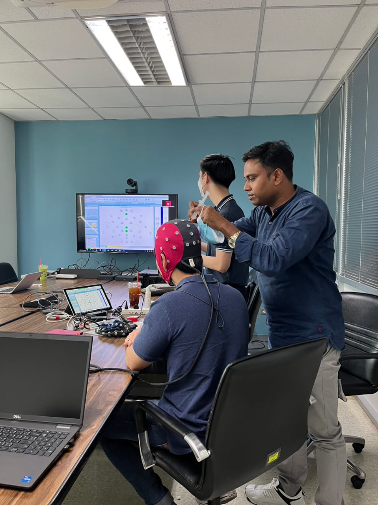
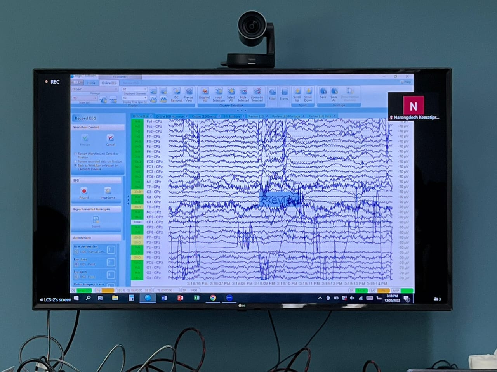
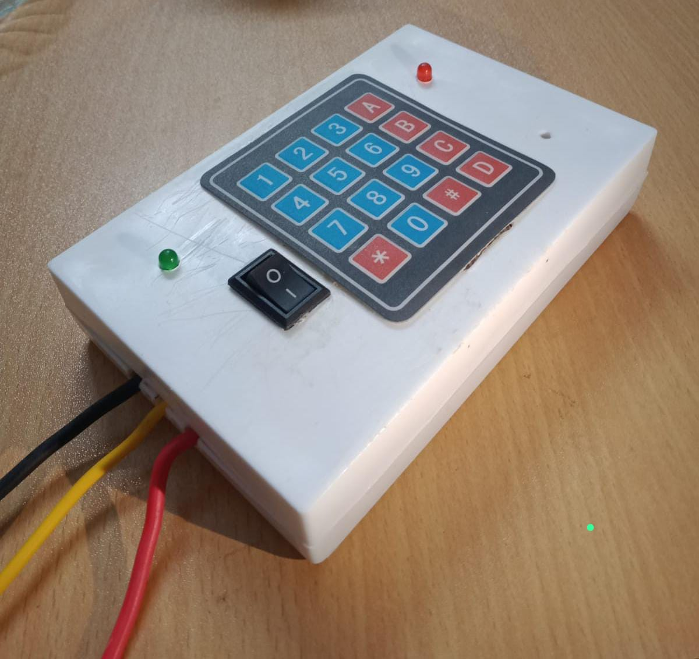
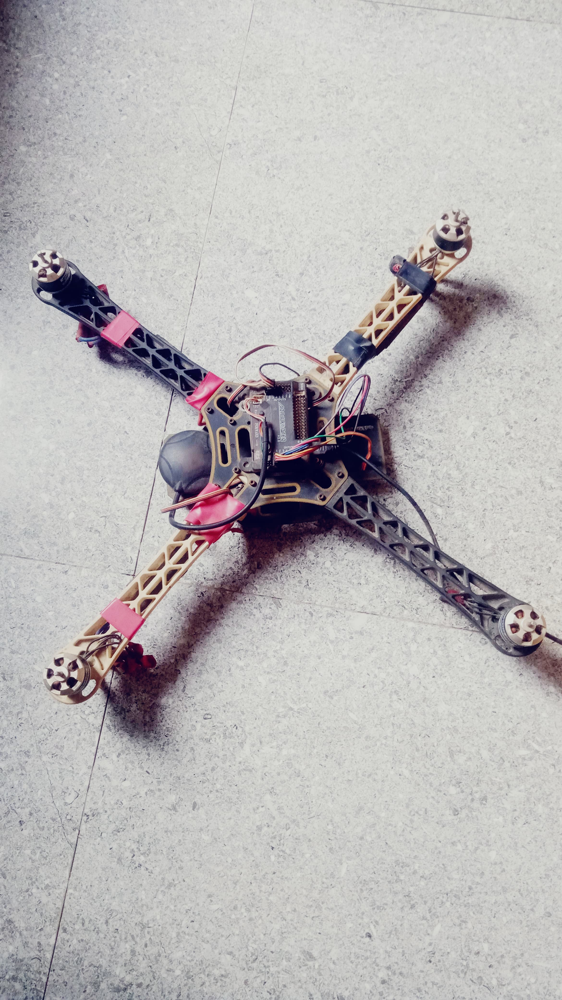
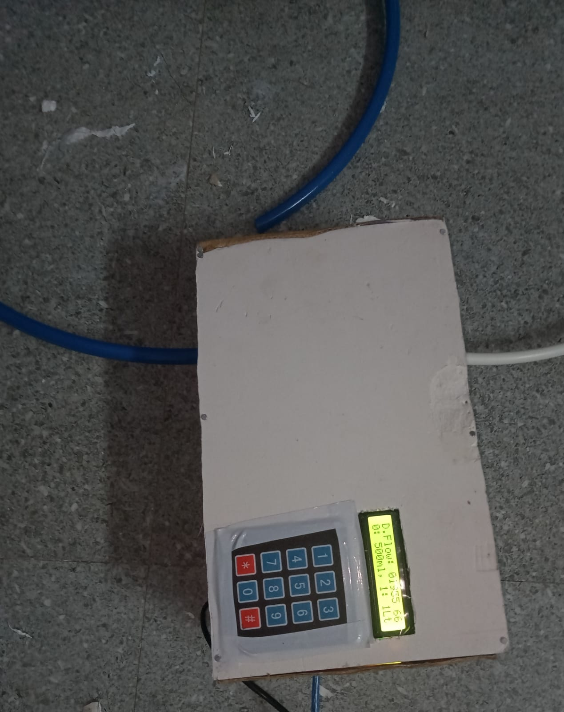
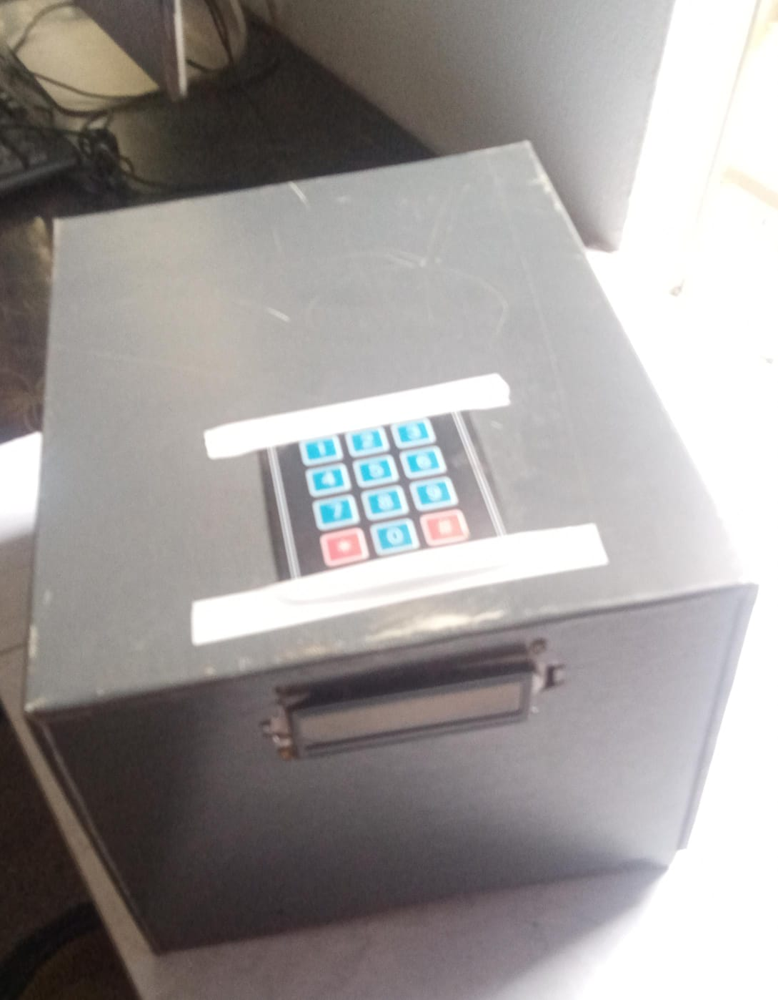
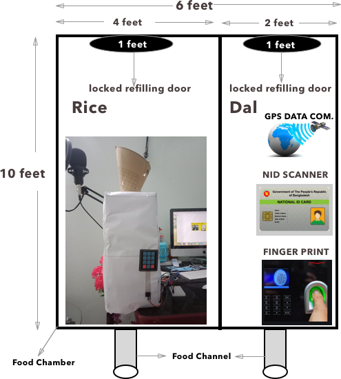

# Hi there, I'm Soliman Faragy 👋

I'm a passionate **Full-Stack Software Engineer** and **Machine Learning / Brain-Computer Interface Researcher** with over 6 years of handson experience building scalable, secure, and high-performance web applications. Specialized in modern tech stacks including Laravel, React.js, Next.js, Node.js, Java (Spring Boot), and AWS/GCP. Adept in microservices architecture, DevOps practices, Agile methodologies, and cloud infrastructure.. I thrive on developing innovative solutions and navigating quick learning curves.

Throughout my career, I’ve had the privilege to work across various industries such as **e-commerce**, **tourism**, and **real estate**, where I enjoy aligning my **interests** with company goals while tackling complex challenges for large scale production grade applications and various workflows. Afterall, I am a passionate coder in both greenfield project as well as legacy codebase.

## 🌟 **Specializations**

- **Back End:** PHP (Laravel), Java (Spring Boot), Node.js (Express), Ruby, Kotlin, React.js/Next.js
- **Front End:** ReactJS, NextJS, JavaScript, TypeScript, Tailwind CSS, CSS, BEM,
- **Databases:** MySQL, PostgreSQL, MongoDB
- **Tools:** Docker, GraphQL, RabbitMQ, CI/CD workflows and deployment(GitHub, GitLab, BitBucket), Elastic Search, AWS, Amazon DynamoDB, Amazon S3, AWS EC2, GCP

## Professional Contribution:

- https://www.dotproperty.co.th/
- https://www.fazwaz.co.th/
- https://hipflat.co.th/
- https://popdeal.io/
- https://www.thailand-property.com/
- https://www.elf925wholesale.com/
- https://www.elf925.com/ etc.

## 🏆 Achievements

- Directors Merit Award (Full Free Scholarship, Metropolitan University, 2010-2014)
- Special Certification Award from Cisco (SUST, 2014)

## 📚 Research

I'm currently researching Brain-Computer Interfaces (BCI) using machine learning methodologies, focusing on classifying silent speech from brain activity.

## 🌟 Projects

- [Brain-Computer Interface]: <a href="https://ieeexplore.ieee.org/document/10354583">Decode Brain Signal Into Thai Word Using EEG and L-SVM</a>
- [Digital Submersible Pump Control Timer]: After running the pump this device help to turn the pump off and save from tank overflow.
- [Drone Development]: Worked on developing a delivery drone with and without GPS capabilities.
- [Digital Fluid Measurement System]: Created a system utilizing a mini pump for precise measurements.
- [Automatic Relief Distribution System]: Developed a system with vending facilities and supervised machine learning.

Brain-Computer Interface:

  
  

Digital Submersible Pump Control Timer, Delivery Drone

  

Digital Fluid Measurement System:

 

Automatic Relief Distribution System:

## 🤝 Connect with Me

- <a href="https://www.linkedin.com/in/md-soliman-f-b3b3a347/">LinkedIn</a>

🚀 Let's build something amazing together! 💻
